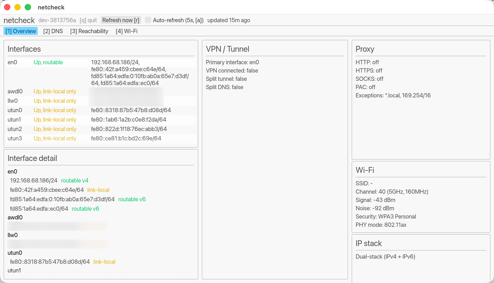

# netcheck

A holistic view of network status on macOS: interfaces, VPN/tunnel state,
DNS resolvers (including split-tunnel/split-DNS), and reachability — the
things you end up checking manually when the Cisco VPN acts up.

netcheck reports:

- **Interfaces** — name, up/down, loopback, addresses
- **VPN / tunnel** — which tunnel interfaces have a real address, what your
  actual default route is, and whether that combination looks like a split
  tunnel
- **DNS** — every resolver macOS knows about, including scoped (per-interface)
  resolvers — the mechanism Cisco AnyConnect and similar clients use for
  split-DNS — and whether a scoped resolver is bound to a VPN tunnel
- **Reachability** — concurrent pings to well-known public DNS servers, and
  concurrent HTTPS connects to well-known domains (not ping, since some
  operators filter ICMP at the edge regardless of whether the service is up)
- **DNS resolution** — resolves well-known domains and reports success,
  addresses, and lookup latency

## Install

Three ways to get netcheck, in order of ease:

### Homebrew (recommended)

```sh
brew tap hugoh/tap
brew install netcheck              # CLI + TUI + GUI
brew install --cask netcheck       # native SwiftUI app
```

You can install either or both — they're independent.

### Direct download

Grab the latest release from the
[Releases page](https://github.com/hugoh/netcheck/releases):

- `netcheck-<version>-aarch64-apple-darwin.tar.gz` — the `netcheck`,
  `netcheck-tui`, and `netcheck-gui` binaries. Unpack and put them on your
  `PATH`.
- `NetCheck-<version>.zip` — the native app. Unzip and drag
  `NetCheck.app` to `/Applications`.

Both are Apple Silicon (arm64) only.

> [!NOTE]
> `NetCheck.app` is ad-hoc signed, not notarized with a Developer ID.
> The Homebrew cask strips the quarantine attribute on install, so it opens
> normally. With a direct download, macOS will flag it as from an
> unidentified developer on first launch — right-click (or Control-click)
> the app and choose **Open**, or clear it manually:
> `xattr -cr /Applications/NetCheck.app`.

### From source

```sh
mise run build:cli       # netcheck-cli
mise run build:tui       # netcheck-tui
mise run build:gui       # netcheck-gui
mise run build:app       # dev build of the native NetCheck.app
mise run bundle:swiftui  # signed release .app bundle of NetCheck
```

## The four flavors

netcheck ships as four separate front ends, all built on the same
diagnostics core, so pick whichever fits how you want to check your network:

| | What it is | Run it |
|---|---|---|
| **CLI** (`netcheck`) | Scriptable, JSON output, one-shot checks | `netcheck status` |
| **TUI** (`netcheck-tui`) | Live-refreshing terminal dashboard | `netcheck-tui` |
| **GUI** (`netcheck-gui`) | Plain cross-platform-style window (egui) — same panels as the TUI, but a resizable window with tabs | `netcheck-gui` |
| **NetCheck.app** | A real native macOS app (SwiftUI/AppKit) — Dark Mode, vibrancy, proper window chrome | open from Applications, or `open /Applications/NetCheck.app` |

`netcheck-gui` can never look pixel-native on macOS — it draws every widget
itself rather than using AppKit. NetCheck.app is the one that's meant to
feel like a Mac app; the GUI is there for the cases (remote/X11, or just
preference) where a plain window beats either a terminal or a native app.

## Screenshots

**CLI** — `netcheck vpn`

```json
{
  "tunnels": [],
  "primary_interface": "en0",
  "connected": false,
  "split_tunnel": false,
  "routed_subnets": []
}
```

**TUI** — `netcheck-tui`

```text
 Overview   DNS   Reachability   Wi-Fi
┌Interfaces────────────────────────────┐┌VPN / Tunnel────────────────┐┌Wi-Fi───────────────────────┐
│en0      UP, ROUTABLE    192.168.68.18││Primary: en0                ││SSID: -                     │
│awdl0    UP, LINK-LOCAL  fe80::xxxx:xx││VPN connected: false        ││Channel: 40 (5GHz, 160MHz)  │
│llw0     UP, LINK-LOCAL  fe80::xxxx:xx││Split tunnel: false         ││Signal: -44 dBm             │
│utun0    UP, LINK-LOCAL  fe80::8318:87││Split DNS: false            ││Noise: -92 dBm              │
│utun1    UP, LINK-LOCAL  fe80::1ab6:1a││                            ││Security: WPA3 Personal     │
│utun2    UP, LINK-LOCAL  fe80::822d:1f││                            ││PHY mode: 802.11ax          │
└──────────────────────────────────────┘│                            ││                            │
┌Interface detail──────────────────────┐└────────────────────────────┘│                            │
│en0                                   │┌Proxy───────────────────────┐│                            │
│  192.168.68.186/24           routable││HTTP: off                   ││                            │
│  fe80::42f:a459:cbee:c64e/64 link-loc││HTTPS: off                  │└────────────────────────────┘
└──────────────────────────────────────┘└────────────────────────────┘└────────────────────────────┘
q: quit   r: refresh now   a: auto-refresh (off)   1-4: tabs   updated 0s ago   netcheck dev-396365d
```

**GUI** (`netcheck-gui`)



**NetCheck.app**:


## Usage

```sh
netcheck status                              # full snapshot as JSON
netcheck interfaces
netcheck dns
netcheck vpn
netcheck ping 1.1.1.1 8.8.8.8
netcheck resolve google.com github.com
netcheck connect amazon.com microsoft.com --port 443

# live terminal dashboard: q quit, r refresh, a toggle auto-refresh
netcheck-tui

# native-style window: same q/r/a keys, [1]-[4] to switch tabs
netcheck-gui
```

The native app, the TUI, and the GUI all auto-refresh every 5 seconds
(off by default in the GUI/native app — toggle with `a`); the CLI runs on
demand and is meant for scripting/piping into `jq`.

NetCheck.app uses Cmd-modified shortcuts instead — `q` to quit, `⌘R` to
refresh, `⌘A` to toggle auto-refresh, `⌘1`-`⌘4` to switch tabs — shown in
its toolbar and footer, so typing in a field can't accidentally trigger
them.
